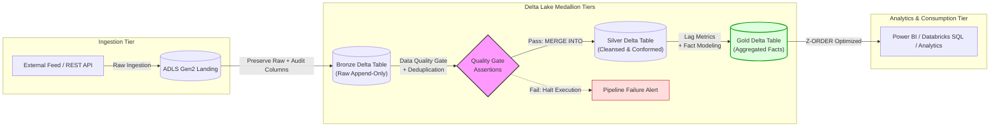

# Azure Databricks Medallion Lakehouse Pipeline — Economic Data Quality & Analytics
[](https://delta.io/)
[](https://azure.microsoft.com/en-us/products/databricks/)
[](https://spark.apache.org/)
[](https://azure.microsoft.com/en-us/products/storage/data-lake-storage/)

> **Portfolio Demo Project** — Demonstrating practical application of Databricks Academy Accreditation principles, bridging relational DBA expertise (ACID, data integrity, indexing) with modern distributed Lakehouse engineering (Delta Lake, PySpark, ADLS Gen2).

An end-to-end **Medallion Architecture (Bronze $\rightarrow$ Silver $\rightarrow$ Gold)** ETL/ELT pipeline covering schema-on-read ingestion, circuit-breaker data quality validations, idempotent `MERGE INTO` operations, analytical fact modeling, and `Z-ORDER` query optimization.

---

## 📌 Key Architectural Highlights
- **Medallion Architecture**: Segregated storage into Landing, Bronze (Raw append-only), Silver (Enriched & Deduplicated), and Gold (Analytical Fact & Aggregate).
- **Data Quality Circuit Breaker**: Pre-write assertions (null-rate thresholds on primary keys and composite key uniqueness) that halt pipeline execution upon quality breach.
- **Idempotent Upserts**: Zero duplicate loads handled via Delta Lake `MERGE INTO` operations.
- **Engineered Audit Trail**: Automatic lineage tracking via metadata attributes (`_ingestion_timestamp`, `_source_file_name`, `_batch_id`, `_silver_updated_at`).
- **Lakehouse Storage Optimization**: File compaction and multi-dimensional clustering using `OPTIMIZE` and `Z-ORDER BY (country_code, year)`.

---

## 🏛️ Architecture Flow



---

## 📂 Repository Structure

```
├── .github/
│   └── workflows/
│       └── ci.yml                  # CI workflow running automated unit & quality tests
├── pipeline/
│   ├── config.py                   # ADLS Gen2 paths, ABFSS URIs & pipeline constants
│   ├── quality_gate.py             # Reusable Data Quality Gate (Not-null & Uniqueness)
│   ├── 01_landing_to_bronze.py     # Schema-on-read ingestion with audit tracking
│   ├── 02_bronze_to_silver.py      # Cleansing, deduplication & MERGE INTO upsert
│   ├── 03_silver_to_gold.py        # Analytical modeling & Delta Z-ORDER optimization
│   ├── orchestrator.py             # End-to-end execution runner
│   └── README.md                   # Technical setup instructions
```

---

## 🛠️ Step-by-Step Data Flow

### 1. Landing to Bronze Layer ([`01_landing_to_bronze.py`](pipeline/01_landing_to_bronze.py))
- Reads raw CSV/JSON payload without schema inference (`inferSchema=False`) to avoid dropping malformed rows.
- Enriches records with lineage audit metadata:
  ```python
  bronze_df = (
      raw_df
      .withColumn("_ingestion_timestamp", current_timestamp())
      .withColumn("_source_file_name", input_file_name())
      .withColumn("_batch_id", lit(batch_id))
  )
  ```
- Appends into the Delta Lake `bronze` table.

### 2. Data Quality & Silver Cleansing ([`02_bronze_to_silver.py`](pipeline/02_bronze_to_silver.py))
- Normalizes attributes to standard `snake_case` and enforces explicit type casting.
- Simple deduplication: `dropDuplicates(["country_code", "year"])`.
- **Quality Gate Verification ([`quality_gate.py`](pipeline/quality_gate.py))**:
  - `validate_not_null`: Zero tolerance for null primary keys.
  - `validate_unique_keys`: Composite key uniqueness check (`groupBy().count().filter(count > 1)`).
- **Idempotent Upsert (`MERGE INTO`)**:
  ```python
  silver_table.alias("target").merge(
      source=silver_df.alias("source"),
      condition="target.country_code = source.country_code AND target.year = source.year"
  ).whenMatchedUpdate(set={...}).whenNotMatchedInsert(values={...}).execute()
  ```

### 3. Gold Analytical Modeling & Z-Order Indexing ([`03_silver_to_gold.py`](pipeline/03_silver_to_gold.py))
- Computes analytical metrics such as Year-over-Year (YoY) growth percentages using window `lag()`.
- Collocates data and resolves small file fragmentation using Delta Lake's `OPTIMIZE` and `Z-ORDER`:
  ```sql
  OPTIMIZE delta.`<gold_path>` ZORDER BY (country_code, year)
  ```

---

## 👤 Author
- **Deleep Augustian** — [LinkedIn](https://www.linkedin.com/in/deleep-augustian-1a91a110/)
