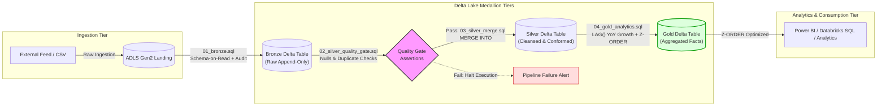

# Azure Databricks Medallion Lakehouse Pipeline — Economic Data Quality & Analytics
[](https://delta.io/)
[](https://azure.microsoft.com/en-us/products/databricks/)
[](https://docs.databricks.com/sql/)
[](https://www.python.org/)
[](https://azure.microsoft.com/en-us/products/storage/data-lake-storage/)

> **Portfolio Demo Project** — Demonstrating practical application of Databricks Academy Accreditation principles, bridging relational DBA expertise (ACID, constraints, indexing, ANSI SQL) with modern distributed Lakehouse engineering (Delta Lake, ADLS Gen2, PySpark orchestration).

An end-to-end **SQL-first Medallion Architecture (Bronze $\rightarrow$ Silver $\rightarrow$ Gold)** ETL/ELT pipeline covering schema-on-read ingestion, circuit-breaker data quality validations, idempotent `MERGE INTO` operations, analytical fact modeling, and `Z-ORDER` query optimization.

---

## 📌 Key Architectural Highlights
- **SQL-First Transformations**: Core transformations, deduplication, and fact aggregations written in declarative ANSI/Databricks SQL.
- **Data Quality Circuit Breaker**: Pre-write sanity checks (null checks on primary keys and duplicate composite key detection) that halt execution before bad data pollutes Silver.
- **Idempotent Upserts**: Zero duplicate loads handled via native Delta Lake `MERGE INTO` statements.
- **Engineered Audit Trail**: Automatic lineage tracking via metadata attributes (`_ingestion_timestamp`, `_source_file_name`, `_silver_updated_at`).
- **Lakehouse Storage Optimization**: File compaction and multi-dimensional clustering using `OPTIMIZE` and `Z-ORDER BY (country_code, year)`.
- **Thin Python Orchestration**: A clean ~35-line Python runner that manages execution flow, logs steps, and enforces quality assertions.

---

## 🏛️ Architecture Flow



---

## 📂 Repository Structure

```
├── .github/
│   └── workflows/
│       └── ci.yml                     # CI workflow running automated pipeline checks
├── sql/
│   ├── 01_bronze.sql                  # Schema-on-read ingestion with lineage metadata
│   ├── 02_silver_quality_gate.sql     # Null checks & composite key duplicate assertions
│   ├── 03_silver_merge.sql            # Cleansing, window deduplication & MERGE INTO upsert
│   └── 04_gold_analytics.sql          # Analytical fact modeling & Delta Z-ORDER optimization
├── runner.py                          # Thin Python driver (~35 lines) executing SQL stages
└── README.md                          # Project documentation & technical architecture
```

---

## 🛠️ Step-by-Step Data Flow

### 1. Landing to Bronze Layer ([`sql/01_bronze.sql`](sql/01_bronze.sql))
- Preserves raw records as strings to prevent ingest drops.
- Captures system lineage metadata (`_ingestion_timestamp`, `_source_file_name`):
  ```sql
  CREATE TABLE IF NOT EXISTS bronze_economic_data (
      country_name STRING, country_code STRING, year STRING, value STRING,
      _ingestion_timestamp TIMESTAMP, _source_file_name STRING
  ) USING DELTA;

  INSERT INTO bronze_economic_data
  SELECT 
      Country_Name, Country_Code, Year, Value,
      CURRENT_TIMESTAMP() AS _ingestion_timestamp,
      input_file_name() AS _source_file_name
  FROM csv.`/tmp/raw_economic_data.csv`;
  ```

### 2. Data Quality Circuit Breaker ([`sql/02_silver_quality_gate.sql`](sql/02_silver_quality_gate.sql))
- Halts execution if either check fails:
  ```sql
  -- 1. Check null primary keys:
  SELECT COUNT(*) FROM bronze_economic_data WHERE country_code IS NULL OR year IS NULL;

  -- 2. Check duplicates on composite keys:
  SELECT country_code, year, COUNT(*) 
  FROM bronze_economic_data 
  GROUP BY country_code, year 
  HAVING COUNT(*) > 1;
  ```

### 3. Silver Cleansing & Idempotent Upsert ([`sql/03_silver_merge.sql`](sql/03_silver_merge.sql))
- Trims whitespace, standardizes casing, and explicitly casts data types.
- Deduplicates incoming batches via windowing and performs an idempotent `MERGE INTO`:
  ```sql
  MERGE INTO silver_economic_data AS target
  USING v_cleaned_bronze AS source
  ON target.country_code = source.country_code AND target.year = source.year
  WHEN MATCHED THEN
      UPDATE SET target.gdp_value = source.gdp_value, target._silver_updated_at = CURRENT_TIMESTAMP()
  WHEN NOT MATCHED THEN
      INSERT (country_code, country_name, year, gdp_value, _source_file_name, _silver_updated_at)
      VALUES (source.country_code, source.country_name, source.year, source.gdp_value, source._source_file_name, CURRENT_TIMESTAMP());
  ```

### 4. Gold Analytical Modeling & Storage Optimization ([`sql/04_gold_analytics.sql`](sql/04_gold_analytics.sql))
- Computes analytical metrics such as Year-over-Year (YoY) growth rate `%` using `LAG()`:
  ```sql
  CREATE TABLE IF NOT EXISTS gold_fact_annual_gdp_growth USING DELTA AS
  SELECT country_code, country_name, year, gdp_value,
         ROUND(((gdp_value - LAG(gdp_value, 1) OVER (PARTITION BY country_code ORDER BY year)) 
                / LAG(gdp_value, 1) OVER (PARTITION BY country_code ORDER BY year)) * 100, 2) AS yoy_growth_pct
  FROM silver_economic_data;
  ```
- Reorganizes files on disk to prevent small-file fragmentation and enables data skipping:
  ```sql
  OPTIMIZE gold_fact_annual_gdp_growth ZORDER BY (country_code, year);
  ```

### 5. Thin Python Orchestrator ([`runner.py`](runner.py))
- Reads the SQL files sequentially, runs the quality gate assertion, and exits with a clear error code if checks fail.

---

## 👤 Author
- **Deleep Augustian** — [LinkedIn](https://www.linkedin.com/in/deleep-augustian-1a91a110/)
