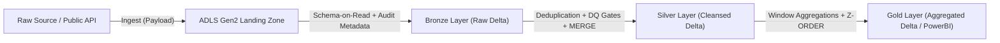

# Azure Databricks Medallion Architecture Pipeline

A production-grade, modular Data Lakehouse pipeline using **Azure Databricks**, **PySpark**, **Delta Lake**, and **Azure Data Lake Storage Gen2 (ADLS Gen2)** designed for data engineering portfolios.

---

## 🏛️ Architecture Overview



1. **Landing Zone**: Ingestion of raw CSV/JSON payload into ADLS Gen2 container.
2. **Bronze Layer (Delta Lake)**: Append-only raw data preservation with system metadata (`_ingestion_timestamp`, `_source_file_name`, `_batch_id`).
3. **Data Quality Gate (`quality_gate.py`)**: Intermediary assertion engine validating primary key nullability, duplicate composite keys, and domain ranges.
4. **Silver Layer (Delta Lake)**: Standardized `snake_case` attributes, explicit casting, deduplication via windowing, and idempotent upserts via `MERGE INTO`.
5. **Gold Layer (Delta Lake)**: Analytical fact modeling (YoY growth rate, lag metrics), and performance optimization with file compaction and `OPTIMIZE ... ZORDER BY (country_code, year)`.

---

## 📁 Repository Structure

```
pipeline/
├── config.py                 # Pipeline storage configurations & dataset references
├── quality_gate.py           # Reusable Data Quality Gate assertion framework
├── 01_landing_to_bronze.py   # Ingestion into append-only Bronze Delta table
├── 02_bronze_to_silver.py    # Cleansing, quality check, and MERGE INTO Silver
├── 03_silver_to_gold.py      # Business aggregations, Gold table & Z-ORDER optimization
└── orchestrator.py           # Master execution pipeline
```

---

## 🚀 How to Run in Azure Databricks

### 1. Storage Account & Unity Catalog Configuration
In Azure Databricks, mount or connect your ADLS Gen2 storage container using Service Principal or Managed Identity:
```python
spark.conf.set(
    "fs.azure.account.auth.type.<storage-account>.dfs.core.windows.net", "OAuth"
)
spark.conf.set(
    "fs.azure.account.oauth.provider.type.<storage-account>.dfs.core.windows.net",
    "org.apache.hadoop.fs.azurebfs.oauth2.ClientCredsTokenProvider"
)
spark.conf.set(
    "fs.azure.account.oauth2.client.id.<storage-account>.dfs.core.windows.net",
    dbutils.secrets.get(scope="dwh-kv", key="sp-client-id")
)
spark.conf.set(
    "fs.azure.account.oauth2.client.secret.<storage-account>.dfs.core.windows.net",
    dbutils.secrets.get(scope="dwh-kv", key="sp-client-secret")
)
spark.conf.set(
    "fs.azure.account.oauth2.client.endpoint.<storage-account>.dfs.core.windows.net",
    f"https://login.microsoftonline.com/{dbutils.secrets.get(scope='dwh-kv', key='sp-tenant-id')}/oauth2/token"
)
```

### 2. Run the Workflow
Execute the stages consecutively or submit [`pipeline/orchestrator.py`](file:///Users/deleepaugustian/Documents/GitHub/Rosmini-Website/portfolio-Deleep/pipeline/orchestrator.py) via a Databricks Job Workflow.
